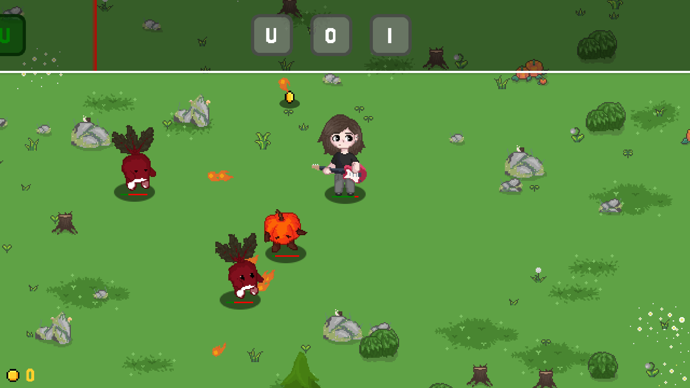



  

# Solo Slash

> Данный репозиторий - индивидуальный проект для курса Основы программирования УрФУ.

Solo Slash - ритм-игра, реализованная на движке MonoGame с архитектурой Entity-Component-System (ECS).

## Идея

Идея игры и стилистика похожа на Fretless - The Wrath of Riffson, главный герой - гитарист, который с помощью навыков своей игры борется с врагами, встающими на его пути.

Механики и интерфейс были частично позаимствованы из VR-игры Beat Saber, где под музыку нужно разбивать нотные блоки, избегая препятствий.

